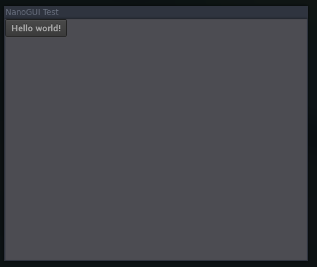

# NanoGUI
NanoGUI is minimalistic Graphics display for developpers to create GUI application <br>
This is an example template that would let you get started easily<br>
More info visit the git [repo](https://github.com/wjakob/nanogui)  
## installation 
clone the repo of nanogui 
```bash 
git clone https://github.com/wjakob/nanogui --recursive

# install deps 
sudo apt-get install cmake xorg-dev libglu1-mesa-dev python-dev
# compiling 
cd nanogui 
cmake . 
make -j 4 
# installing 
sudo make install 
```

# Running the app 
```bash
cmake .
make -j4 
./myTarget

```


## Refrences
[Post](https://www.linkedin.com/pulse/creating-custom-guis-c-deep-dive-low-level-graphics-ayman-alheraki-ttmdf/?trackingId=2Zwq9Uqs4SfNpwYavHIjRw%3D%3D)
